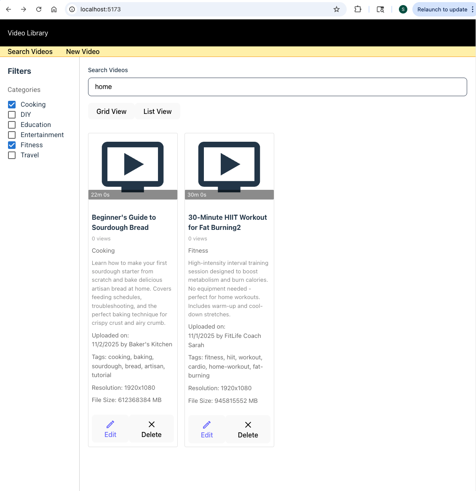
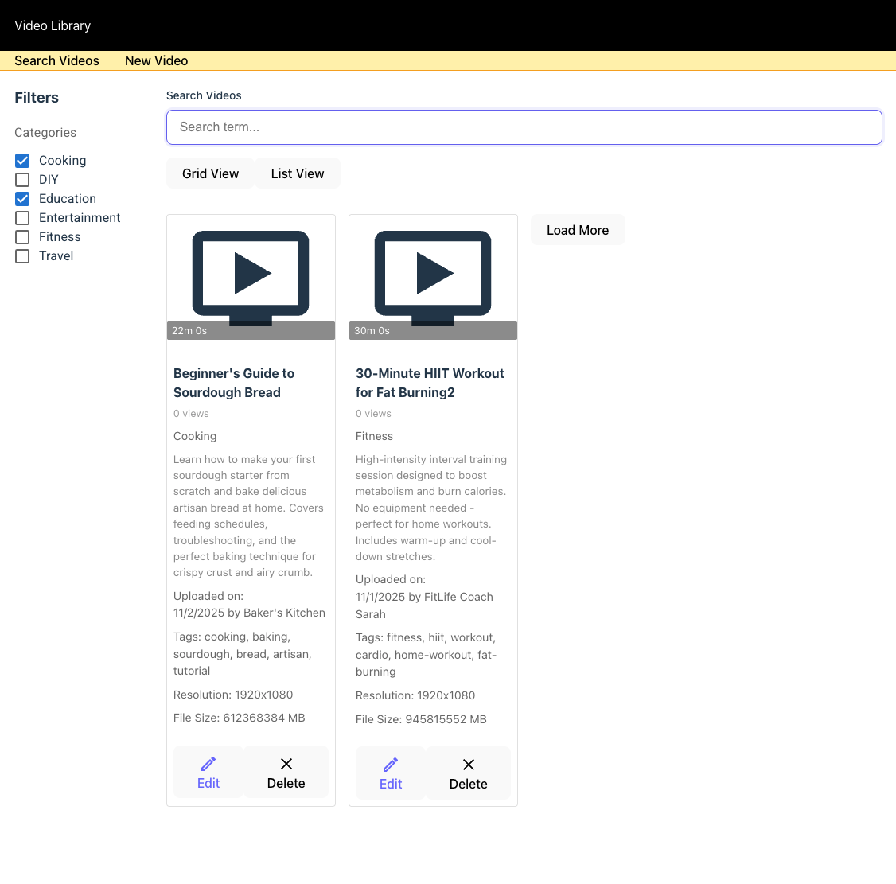
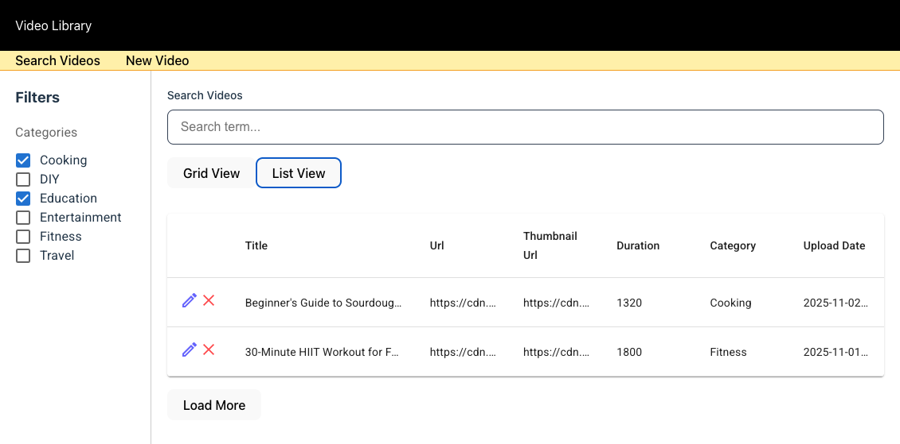
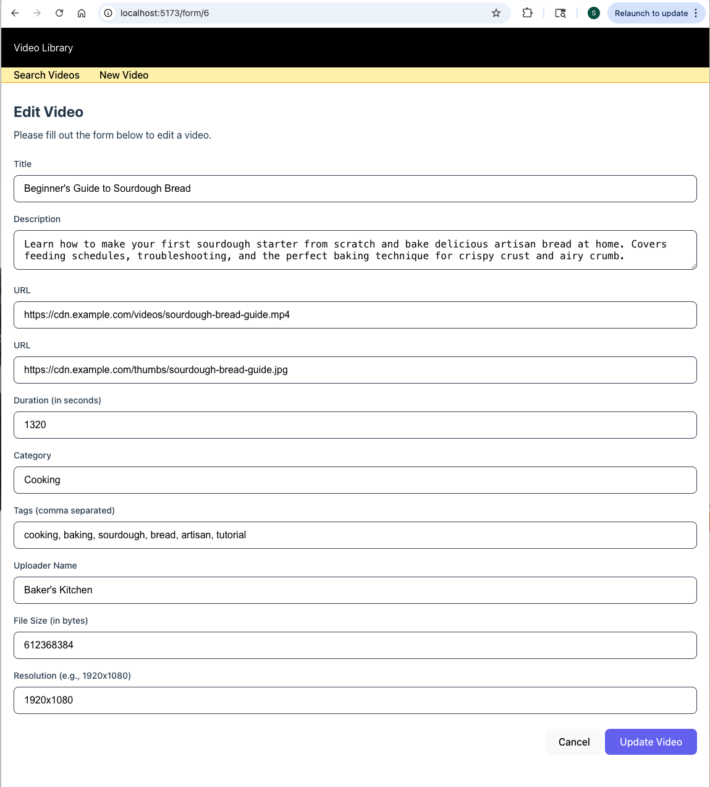
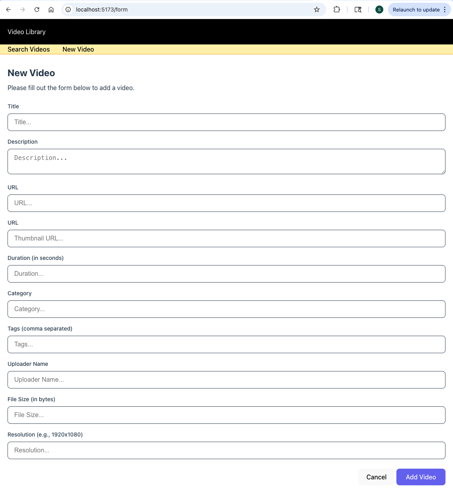
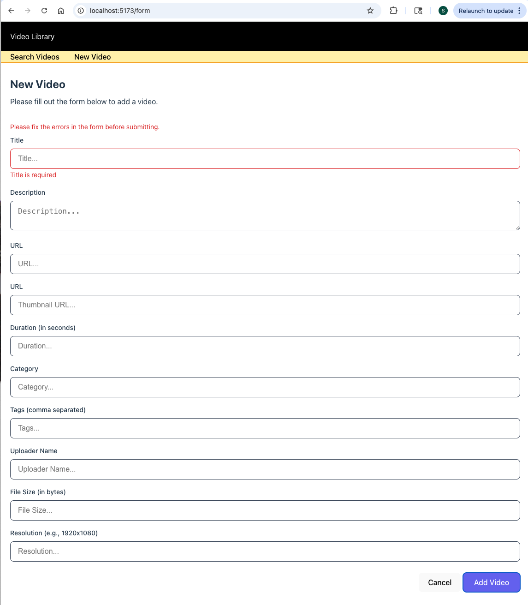

# Video Library Application

A full-stack video library management system built with React and Node.js that allows users to browse, search, filter, and manage video content with a modern, responsive interface.

## Features

### Frontend (React)
- **Grid and List View Modes** - Toggle between grid and list layouts for video browsing
- **Advanced Search** - Search videos by title, description, and other metadata
- **Category Filtering** - Filter videos by category with multi-select support
- **Pagination** - Efficient browsing with configurable page size
- **Video Management** - Add, edit, and delete videos through an intuitive form interface
- **Responsive Design** - Material-UI components with custom SCSS styling
- **Thumbnail Previews** - Display video thumbnails with metadata
- **Real-time Updates** - Dynamic content updates without page refresh

### Backend (Node.js/Express)
- **RESTful API** - Clean API architecture for video CRUD operations
- **MySQL Database** - Robust relational database with indexed queries
- **Search & Filter** - Advanced query capabilities with pagination
- **Security** - Helmet.js for security headers, CORS configuration
- **Logging** - Winston for application logging, Morgan for HTTP request logging
- **Error Handling** - Comprehensive error handling with graceful shutdown
- **Health Check** - Endpoint for monitoring server status

## Tech Stack

### Frontend
- **React 19** - Modern React with hooks
- **Vite 6** - Fast build tool with HMR (Hot Module Replacement)
- **Material-UI (MUI) 7** - Component library for UI elements
- **React Router DOM 7** - Client-side routing
- **SASS/SCSS** - Enhanced CSS with variables and nesting
- **ESLint** - Code quality and consistency

### Backend
- **Node.js** - JavaScript runtime
- **Express 5** - Web application framework
- **MySQL 2** - Database client
- **Winston** - Logging library
- **Morgan** - HTTP request logger
- **Helmet** - Security middleware
- **CORS** - Cross-origin resource sharing
- **dotenv** - Environment variable management
- **Nodemon** - Development auto-restart

## Prerequisites

Before you begin, ensure you have the following installed:
- **Node.js** (v16 or higher)
- **npm** (v8 or higher)
- **MySQL** (v8 or higher)
- **Git** (for cloning the repository)

## Installation & Setup

### 1. Clone the Repository
```bash
git clone <repository-url>
cd <project-directory>
```

### 2. Database Setup

Create a MySQL database and run the schema:

```bash
mysql -u your_username -p
```

```sql
CREATE DATABASE video_library;
USE video_library;
```

Then run the table creation script located at `server/table_video.sql`:

```bash
mysql -u your_username -p video_library < server/table_video.sql
```

The videos table includes the following fields:
- `id` - Auto-incrementing primary key
- `title` - Video title (required)
- `description` - Video description
- `url` - Video URL
- `thumbnail_url` - Thumbnail image URL
- `duration` - Video duration in seconds
- `category` - Video category
- `tags` - JSON array of tags
- `upload_date` - Date video was uploaded (required)
- `uploader_name` - Name of the uploader
- `view_count` - Number of views (default: 0)
- `file_size` - File size in bytes
- `resolution` - Video resolution (e.g., "1080p")
- `created_at` - Timestamp of record creation
- `updated_at` - Timestamp of last update

### 3. Backend Setup

Navigate to the server directory and install dependencies:

```bash
cd server
npm install
```

Create a `.env` file in the `server` directory:

```env
# Server Configuration
PORT=3000
NODE_ENV=development

# Database Configuration
DB_HOST=localhost
DB_USER=your_mysql_username
DB_PASSWORD=your_mysql_password
DB_NAME=video_library

# Frontend URL (for CORS)
FRONTEND_URL=http://localhost:5173
```

### 4. Frontend Setup

Navigate to the client directory and install dependencies:

```bash
cd ../client
npm install
```

The client already has a `.env.development` file configured to connect to `http://localhost:3000`.

## Running the Application

### Development Mode

**Start the Backend Server:**
```bash
cd server
npm run dev
```
The server will start on `http://localhost:3000` with auto-restart on file changes.

**Start the Frontend Development Server:**
```bash
cd client
npm run dev
```
The client will start on `http://localhost:5173` with hot module replacement.

### Production Mode

**Build the Frontend:**
```bash
cd client
npm run build
```
The production build will be created in the `client/dist` directory.

**Start the Backend Server:**
```bash
cd server
npm start
```

You can serve the frontend build using a static file server or configure the Express server to serve the static files.

## API Endpoints

### Base URL: `http://localhost:3000/api`

#### Health Check
- **GET** `/health` - Check server status

#### Videos

- **GET** `/videos` - Get all videos (with pagination)
  - Query params: `page`, `limit`, `category`
  
- **GET** `/videos/search` - Search videos
  - Query params: `q` (search term), `page`, `limit`, `category`
  
- **GET** `/videos/:id` - Get a specific video by ID

- **POST** `/videos` - Create a new video
  - Body: JSON object with video data
  
- **PUT** `/videos/:id` - Update an existing video
  - Body: JSON object with updated video data
  
- **DELETE** `/videos/:id` - Delete a video

### Example Request

```bash
# Get all videos with pagination
curl http://localhost:3000/api/videos?page=1&limit=10

# Search videos
curl http://localhost:3000/api/videos/search?q=tutorial&category=education

# Create a new video
curl -X POST http://localhost:3000/api/videos \
  -H "Content-Type: application/json" \
  -d '{
    "title": "My Video",
    "description": "A great video",
    "url": "https://example.com/video.mp4",
    "thumbnail_url": "https://example.com/thumb.jpg",
    "category": "tutorial",
    "upload_date": "2024-01-01"
  }'
```
### Screenshots

#### Home Page - Grid View


#### Home Page - Grid View with Filters


#### Home Page - List View


#### Edit Video


#### New Video


#### New Video with Errors



## Project Structure

```
video-library/
├── client/                    # React frontend
│   ├── public/               # Static assets
│   ├── src/
│   │   ├── components/       # React components
│   │   │   ├── AddVideoForm.jsx      # Video creation/edit form
│   │   │   ├── AddVideoForm.scss     # Form styles
│   │   │   ├── Header.jsx            # Application header
│   │   │   ├── Header.css            # Header styles
│   │   │   ├── VideoFilters.jsx      # Category filter component
│   │   │   ├── VideoFilters.css      # Filter styles
│   │   │   ├── VideoGrid.jsx         # Grid view component
│   │   │   ├── VideoGrid.scss        # Grid styles
│   │   │   ├── VideoList.jsx         # List view component
│   │   │   ├── VideoList.scss        # List styles
│   │   │   ├── VideoSearch.jsx       # Search component
│   │   │   ├── VideoThumbnail.jsx    # Video card component
│   │   │   └── Videos.jsx            # Main videos container
│   │   ├── assets/           # Images and other assets
│   │   ├── App.jsx           # Main App component
│   │   ├── App.css           # App styles
│   │   ├── main.jsx          # Entry point
│   │   └── index.css         # Global styles
│   ├── .env.development      # Development environment variables
│   ├── index.html            # HTML template
│   ├── package.json          # Frontend dependencies
│   ├── vite.config.js        # Vite configuration
│   └── eslint.config.js      # ESLint configuration
│
└── server/                    # Node.js backend
    ├── src/
    │   ├── controllers/      # Route controllers
    │   │   └── videoController.js    # Video CRUD logic
    │   ├── routes/           # API routes
    │   │   └── video.js              # Video routes
    │   ├── database/         # Database connection
    │   │   └── mysql.js              # MySQL config
    │   ├── utils/            # Utility functions
    │   │   └── logging.js            # Winston logger setup
    │   ├── app.js            # Express app configuration
    │   └── server.js         # Server entry point
    ├── table_video.sql       # Database schema
    ├── app.log               # Application logs
    └── package.json          # Backend dependencies
```

## Development

### Frontend Development

**Linting:**
```bash
cd client
npm run lint
```

**Preview Production Build:**
```bash
cd client
npm run preview
```

### Backend Development

The backend uses Nodemon for automatic restarts during development. Any changes to `.js` files will trigger a restart.

**View Logs:**
Logs are written to `server/app.log` and also displayed in the console during development.

## Environment Variables

### Server (.env)

| Variable | Description | Default |
|----------|-------------|---------|
| `PORT` | Server port | `3000` |
| `NODE_ENV` | Environment (development/production) | `development` |
| `DB_HOST` | MySQL host | `localhost` |
| `DB_USER` | MySQL username | - |
| `DB_PASSWORD` | MySQL password | - |
| `DB_NAME` | Database name | `video_library` |
| `FRONTEND_URL` | Frontend URL for CORS | `http://localhost:5173` |

### Client (.env.development)

| Variable | Description | Default |
|----------|-------------|---------|
| `VITE_VIDEO_LIBRARY_API_URL` | Backend API URL | `http://localhost:3000` |

## Features in Detail

### Video Browsing
- Switch between grid and list view modes
- Responsive thumbnail cards with hover effects
- Display metadata including title, description, category, uploader, and view count
- Smooth pagination with previous/next navigation

### Search & Filter
- Real-time search across video titles and descriptions
- Multi-select category filtering
- Combined search and filter capabilities
- Clear all filters option

### Video Management
- Add new videos with a comprehensive form
- Edit existing videos (accessible via route: `/form/:id`)
- Delete videos with confirmation
- Form validation for required fields
- Date picker for upload date selection

### Security Features
- Helmet.js for secure HTTP headers
- CORS configuration to prevent unauthorized access
- Request body size limits
- Input sanitization (ready for implementation)

## Known Issues & Future Enhancements

### TODO Items
- Add input validation middleware for API endpoints
- Implement authentication and authorization
- Add video upload functionality (currently URLs only)
- Implement video player integration
- Add user management system
- Implement advanced sorting options
- Add favorites/bookmark functionality
- Create admin dashboard
- Add video analytics and statistics
- Implement rate limiting

## License

This project is licensed under the ISC License.

## Support

For issues, questions, or contributions, please contact the development team or create an issue in the repository.

## Acknowledgments

- Built with React and Node.js
- UI components from Material-UI
- Database powered by MySQL
- Icons from Material-UI Icons
